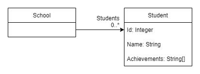

# Reducible

## Nested reducers
### Goal
So far we have composed reducers horizontally, meaning we combined reducers that
work on the same `TState` and same `TDelta`.

This tutorial will demonstrate how to reuse reducers vertically.


### Instructions

Create a new console app with the following `State` and `Delta` classes

```c#
record School(ImmutableArray<Student> Students);
record Student (int Id, string Name)
{
	public ImmutableHashSet<string> Achievements { get; init; } = ImmutableHashSet.Create<string>(StringComparer.InvariantCultureIgnoreCase);
}

record AddStudentAchievement(int StudentId, string Achievement);
```

**State diagram**




### Requirements
We have a school with zero to many students. We need to ensure that the student
identified in the `AddStudentAchievement` delta is added to the correct student.

If the student is present in the school, and the student doesn't already have
that achievement, then we need

1. A new state for the individual `Student` with the achievement included.
2. A new collection of students to hold the original students + the replacement
   state for the individal student.
3. Finally, we will need a new `School` state that holds a reference to the
   new collection of students.

#### Step 1 - Student reducer

Add a reducer to combine the `Student` state with the `AddStudentAchievement` delta.

```c#
var studentAddAchievementReducer = Reducer
  .Given<Student, AddStudentAchievement>()
  .When((student, delta) => student.Id == delta.StudentId && !student.Achievements.Contains(delta.Achievement))
  .Then((student, delta) => student with { Achievements = student.Achievements.Add(delta.Achievement) });
```

* **Given** the inputs are a `Student` state and an `AddStudentAchievement` delta
* **When** an individual student has the same `Id` as the one specified in the `AddStudentAchievement.StudentId` delta **and**
the student doesn't already have the achievement specified in the `AddStudentAchievement.Achievement`
* **Then** we need a new student state based on the current state, but with the achievement added.

##### Use of Immutable* classes
Note the use of `ImmutableArray` and `ImmutableHashSet` in this example. These classes are optimised for creating new collections
based on the original.

If we were to use and IReadOnlyCollection, for example, the process of creating a new collection based on an existing one but with
a single element replaced would look something like the following.

```c#
var newStudents = students
  .Select( x => x.Id != 42 ? x : x with { Something = "Different" })
  .ToList()
  .AsReadOnly();
```

Apart from creating a new list, this code has to iterate the whole list and add every unmodified element to the new list, and this
takes time, especially when the list is very large.  The `Immutable*` classes are optimised to avoid having to do this by re-using
all of the original nodes except for

1. The node that has been replaced.
2. The top node that holds references to those nodes.

#### Step 2 - School reducer

Now that we have a conditional reducer for adding an achievement to a `Student` we need a reducer for our school. We want to
keep our reducers as focused as possible and a reducer that operates on a `School` state but modifies `School.Students` is
too complex.

This is where we need to nest reducers, and ***Reducible*** handles this scenario for us very simply.

Create a reducer that reduce `School` state with `AddStudentAchievement` delta state.

```c#
var schoolAddAchievementReducer = Reducer
  .Given<School, AddStudentAchievement>()
  .WhenReducedBy(x => x.Students, studentAddAchievementReducer)
  .Then((school, students) => school with { Students = students });
```

* **Given** the inputs are a `School` state and an `AddStudentAchievement` delta
* **WhenReducedBy** specifies which property on the `School` state should be reduced, and which reducer should perform the reducing.
* **Then** reduce the existing `School` state with the new value required for `School.Students`.

`WhenReducedBy` expects collections to be of type `ImmutableArray<TElement>` and then iterates over each element in the
array. The reducer `studentAddAchievementReducer` is executed for each one.

If the nested student reducer does not reduce any elements in the `ImmutableArray<Student>` then the **Then** step is
never executed, and the reducer returns `(false, originalState)`.

Each time the reducer does reduce and element (i.e. returns `(true, reducedStudent)` state) then the `WhenReducedBy` method
will get the `ImmutableArray<Student>` to create a copy of itself with the modified student state replacing the original
student.

When the nested reducer returns at least one reduced element (Student), the **Then* step is executed, passing in the `School` state
and the new `ImmutableArray<Student>`, and is expected to return new state for `School` with the new `Students` collection.

### Writing the consuming code

Add the following code to execute the nested reducer.

```c#
var student1 = new Student(1, "Peter Morris");
var student2 = new Student(2, "Steven Cramer");

var allStudents = ImmutableArray.Create<Student>(student1, student2);
var school = new School(allStudents);

var addAchievementDelta = new AddStudentAchievement(2, "Smells");

for (int i = 0; i < 2; i++)
{
  (bool changed, school) = schoolAddAchievementReducer(school, addAchievementDelta);
}
```

The state in this example changes as follows, note how when Steven Cramer's state
does not change, the school's state doesn't change either.

```
Original state={
  "Students": [
    {
      "Id": 1,
      "Name": "Peter Morris",
      "Achievements": []
    },
    {
      "Id": 2,
      "Name": "Steven Cramer",
      "Achievements": []
    }
  ]
}
Step=1, Changed=True, State={
  "Students": [
    {
      "Id": 1,
      "Name": "Peter Morris",
      "Achievements": []
    },
    {
      "Id": 2,
      "Name": "Steven Cramer",
      "Achievements": [
        "Smells"
      ]
    }
  ]
}
Step=2, Changed=False, State={
  "Students": [
    {
      "Id": 1,
      "Name": "Peter Morris",
      "Achievements": []
    },
    {
      "Id": 2,
      "Name": "Steven Cramer",
      "Achievements": [
        "Smells"
      ]
    }
  ]
}
```

### Summary
1. Nesting reducers allows us to keep our reducers focused only on a single state type.
2. A reducer that contains other complex types should use a nested reducer rather than modifying that state directly.
3. Avoid a reducer having to know intimate details about another class's state.
4. Nesting existing reducers allows us to keep our state changes consistent throughout large and complex state trees.
